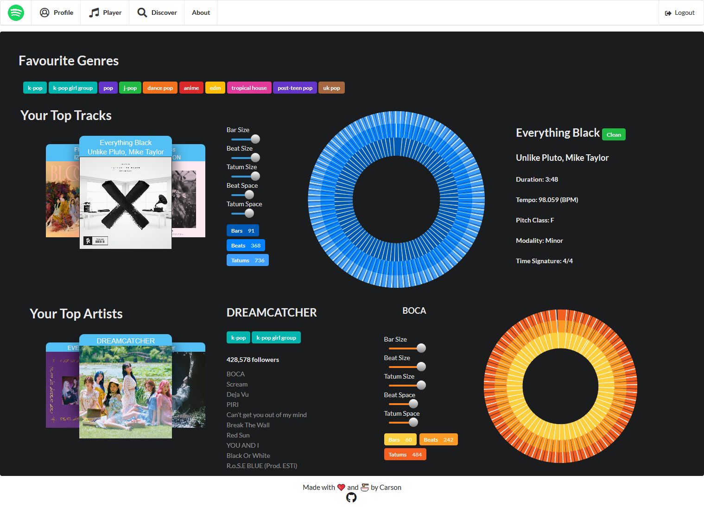

## Features
- View top tracks/artists/genres
- Tweakable sunburst of the track being analyzed (bar, beats, tatum) size and spacing
- Discover songs by genre and other song features (acousticness, danceability, energy, instrumentalness, speechiness, valence, tempo)

## Setup
In the `./src` directory
### `npm install`
To install all dependencies
### `npm start`
Runs the app in the development mode. 
Open [http://localhost:3000](http://localhost:3000) to view it in the browser
